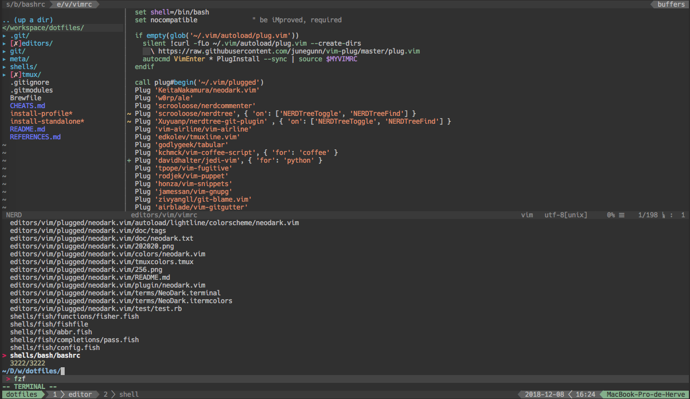

# Dotfiles

Dotfile management using [Dotbot](https://github.com/anishathalye/dotbot).
Structure of this repository is strongly inspired by [vsund](https://github.com/vsund/dotfiles).

## Dependencies

* git
* python
* tmux
	* tmuxinator
* vim
* bash
* fish
  * fisher

## Installation

```bash
~$ git clone --recursive https://github.com/HerveMARTIN/dotfiles.git
```
or for me
```bash
~$ git clone --recursive git@github.com:HerveMARTIN/dotfiles.git
```
For installing a predefined profile:

```bash
~/.dotfiles$ ./install-profile <profile> [<configs...>]
# see meta/profiles/ for available profiles
```

For installing single configurations:

```bash
~/dotfiles$ ./install-standalone <configs...>
# see meta/configs/ for available configurations
```

## Contents

### Profiles

```
meta/profiles/
├── osx
└── ubuntu
```

### Dotbot configurations

```
meta/configs/
├── bash.yaml
├── fish.yaml
├── git.yaml
├── homebrew.yaml
├── tmux.yaml
└── vim.yaml
```

## Screenshots

### Vim inside tmux


[...]
